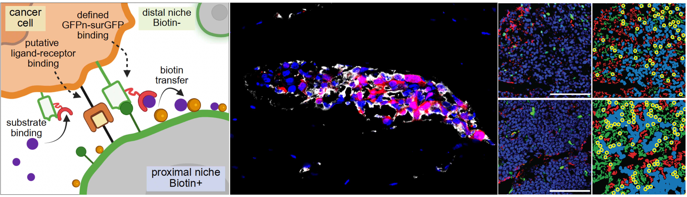
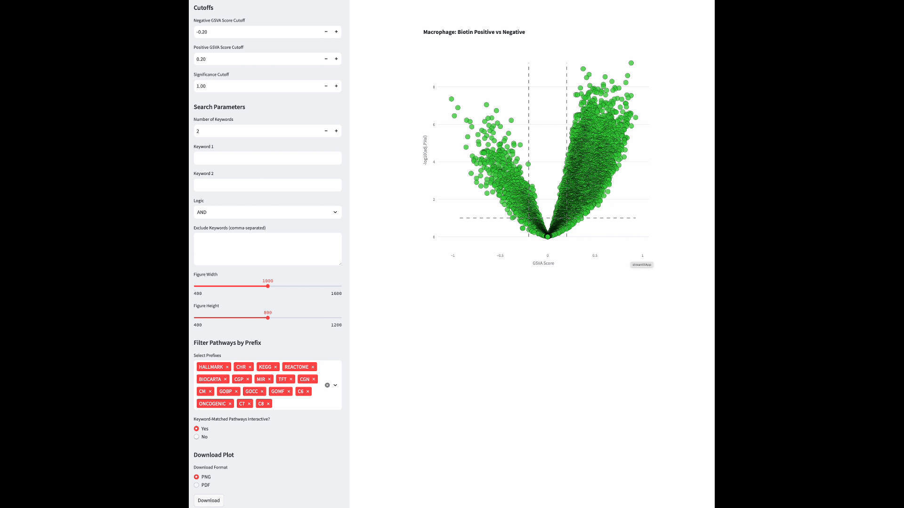

<!-- Top banner image (full width) -->

  

# Unbiased metastatic niche-labeling identifies estrogen receptor-positive macrophages as a barrier of T cell infiltration during bone colonization

This repository provides instructions and code to reproduce the major results, numerics, and figures from the <a href="https://doi.org/10.1101/2024.05.07.593016"><b>manuscript</b></a>:

### Citation

Xu, Z., Liu, F., Ding, Y., Hao, X., Pan, T., Miles, G., Wu, Y.-H., Liu, J., Bado, I. L., Zhang, W., Wu, L., Gao, Y., Yu, L., Edwards, D. G., Chan, H. L., Aguirre, S., Dieffenbach, M. W., Chen, E., Shen, Y., Hoffman, D., Dominguez, L. B., Rivas, C. H., Chen, X., Wang, H., Gugala, Z., Satcher, R. L., & Zhang, X. H.-F. (2024). Unbiased metastatic niche-labeling identifies estrogen receptor-positive macrophages as a barrier of T cell infiltration during bone colonization. <i>Cell</i> (accepted). https://doi.org/10.1101/2024.05.07.593016

 

### Interactive Volcanoplot: exploying differentially regulated pathways between biotin positive and negative populations
#### It may take a while to load the app, please be patient

SAMENT Macrophage: https://samentexplore-73cfuwnsd8tzxatzwvcwvv.streamlit.app
 

SAMENT Neutrophil: https://neutrophilbiotinpositive-vs-negativegsvapy-dd42nk8mhnrf4vjhvuo.streamlit.app/
</a>
  

  
### Data

All intermediate data produced by running this code, as described below, are available for download on <a href="https://doi.org/10.5281/zenodo.14796581"><b>Zenodo</b></a>.

### Overview

These instructions will guide you through the following:
 
1. Integrating datasets, applying batch correction, and reproducing analysis from the manuscript.  
 
2. Reproducing the results from analyzing integrated bulk/microarray datasets.  
 

| **File Name**                                    | **Description**                                                                 | 
|--------------------------------------------------|---------------------------------------------------------------------------------|
| 01_preprocessing_demultiplexing_template.Rmd      | Process Cell Ranger outputs and generate individual Seurat objects, including demultiplexing              |
| 02_integration.Rmd          | Integration of the single cell objects                  |
| 03_scanpy_plot.ipynb                                    | Generate the plots in Scanpy                                              | 
| 04_processing_for_DESeq2.Rmd     | Prepare DESeq2 object for DEG and pathway analysis                              |
| 05_DESeq2_DEG.Rmd                       | DEG analysis                                                                   |         |
| 06.1_pre_requested_Matrix.utils.R                                      | Prerequested package                                                   |                 |
| 06.2_GSEA.Rmd                                      | GSEA analysis                                                                  |
| 07.GSVA.Rmd                       | GSVA analysis                                                           | 
| 08.velocyto.ipynb                                  | trajectory analysis                                               |
| 09.expression_distence.ipynb | Transcriptomic differences                                   |
| 10.CellChat_comparsion.Rmd | Cell-cell conmunication analysis                                   |

---
### Data files (from Zenodo)

<table class="zenodo-table">
  <colgroup>
    <col><col><col>
  </colgroup>
  <thead>
    <tr>
      <th><b>Directory/File</b></th>
      <th><b>Description</b></th>
      <th><b>Related Figure</b></th>
    </tr>
  </thead>
  <tbody>
    <tr>
      <td>immunofluourscance-image-spatial-analysis_ERE_or_ERa-positive-macrophages_distribution.zip</td>
      <td>Spatial analysis measures Erα+/ERE+ macrophage distance to its nearest tumor cell.</td>
      <td>Fig S4G–L</td>
    </tr>
    <tr>
      <td>immunofluourscance-image-spatial-analysis_diffusion-lesions_niche-labeling-model-comparisions.zip</td>
      <td>Spatial analysis compares niche-labeling methods in bone metastasis (diffusion lesions).</td>
      <td>Fig 2E, Fig S2B, Fig S2C</td>
    </tr>
    <tr>
      <td>SAMENT_single_cell_per-sample-Seurat_objects.zip</td>
      <td>Individual SAMENT Seurat and Scanpy objects from demultiplexed scRNA-seq (no cell-type annotation).</td>
      <td>/</td>
    </tr>
    <tr>
      <td>immunofluourscance_image_spatial_analysis_demonstration_scripts_and_data.zip</td>
      <td>Demonstration scripts and data for customized spatial analysis.</td>
      <td>/</td>
    </tr>
    <tr>
      <td>SAMENT_single_cell_integrated_objects.zip</td>
      <td>Integrated SAMENT Seurat and Scanpy objects (batch-corrected, cell-type annotated).</td>
      <td>All SAMENT scRNA-seq related panels</td>
    </tr>
    <tr>
      <td>immunofluourscance-image-spatial-analysis_isolate-lesions_niche-labeling-model-comparisions.zip</td>
      <td>Spatial analysis compares niche-labeling methods in bone metastasis (isolated lesions).</td>
      <td>Fig 2D, Fig S2A</td>
    </tr>
    <tr>
      <td>cellranger_demultiplexed_scRNA-seq_matrix.zip</td>
      <td>scRNA-seq Cell Ranger outputs.</td>
      <td>/</td>
    </tr>
    <tr>
      <td>Macrophage_LysM_Esr1_KO_single_cell_integrated_objects.zip</td>
      <td>Integrated LysM-Esr1 Seurat and Scanpy objects (batch-corrected, cell-type annotated).</td>
      <td>All LysM-Esr1 scRNA-seq related panels</td>
    </tr>
    <tr>
      <td>Macrophage_LysM_Esr1_KO_single_cell_per-sample-Seurat_objects.zip</td>
      <td>Individual LysM-Esr1 Seurat and Scanpy objects from demultiplexed scRNA-seq (no cell-type annotation).</td>
      <td>/</td>
    </tr>
    <tr>
      <td>immunofluourscance-image-spatial-analysis_T_cell_distribution_in_ctrl-Esr1KO.zip</td>
      <td>Spatial analysis measures T cell distribution in the TME.</td>
      <td>Fig 7</td>
    </tr>
    <tr>
      <td>scRNA-seq_analysis_scripts.zip</td>
      <td>All scRNA-seq analysis scripts.</td>
      <td>/</td>
    </tr>
  </tbody>
</table>

---

### Prepared by Fengshuo Liu
